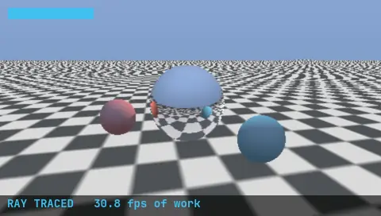
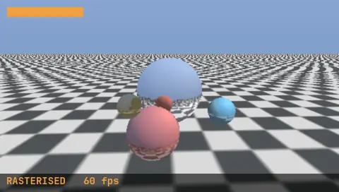

# PSP Raytracer

A real-time ray tracer for the Sony PSP, written in Rust.



Four spheres orbit over an infinite checkerboard. Every pixel of each sphere
follows a ray: one for the surface, one towards the light for the shadow, and
one bounce off the chrome sphere. That is why the spheres appear in each other,
and why the checkerboard is legible in the mirrored one.

The floor and the sky are not traced. They are drawn by the PSP's Graphics
Engine, which is a fixed-function unit from 2004 that textures triangles and
can do nothing else — but a perspective checkerboard and a vertical gradient
are exactly what it was built for, and it does them for free. Tracing them was
costing three quarters of every frame, because a floor pixel needs a shadow ray
and a reflection ray and there is a great deal more floor than sphere.

So the CPU traces only the spheres, inside their projected silhouettes, and
hands the result to the GE as a texture with the misses left transparent.

## Two renderers, L and R



The camera circles the scene once every twelve seconds, which is what makes the
two distinguishable at all: watch the chrome sphere. The shoulder buttons switch
between the renderers, and left alone the demo alternates every six seconds.

The scene, the camera and the resolution are identical, and the two pictures are
close enough that the coloured bar in the corner is there to say which one is
running.

**Ray traced** is the animation at the top: every sphere pixel follows real
rays, so the reflected checkerboard slides across the chrome as the camera goes
round. 30.8 fps of work, presented at 26.6.

**Rasterised** replaces the tracing with triangles — and takes its shading from
the ray tracer all the same, just earlier. Each sphere is traced once over every
surface normal that can face the camera, and the answer, highlight and
reflection included, goes into a 64x64 texture indexed by that normal. The GE
then draws 1440 triangles per sphere and looks the answer up.

Because the camera moves, one sphere's texture is re-traced every frame, so the
reflections keep up. That costs 12.1 ms of the 16.7 ms a frame has, and the
result is a locked 60 fps against the ray tracer's 26.6.

Ray traced at load time, rasterised at run time. What it gives up is a quarter
of a second of lag in the reflections, and silhouettes that are polygons up
close. Everything else survives, which is the surprising part.

## Measured

300 frames under PPSSPP, timed by the PSP's own clock:

| | Ray traced | Rasterised |
|---|---|---|
| Presented | 26.6 fps | 58.8 fps |
| Work per frame | 32.4 ms | 12.1 ms |
| Resolution | 480x272 native | 480x272 native |

Two frame rates, because they mean different things. Waiting for vertical blank
means a frame lasts a whole number of 16.68 ms intervals, so the *presented*
rate can only ever be 60/n — 60, 30, 20, 15. There is no such thing as 24 fps
on this machine; 26.6 is frames alternating between two and three intervals.
The *work* figure is what the renderer actually costs, and it is the number
that moves when the code gets faster.

Both are emulated time. PPSSPP is not cycle-accurate, so treat them as a
regression signal rather than a prediction for real hardware.

### How it got there

Starting from a full-screen traced image at 120x68 upscaled 4x:

| Change | fps |
|---|---|
| Quarter resolution, everything traced | 16.8 |
| Half resolution | 4.2 |
| Hardware square root instead of `libm` | 6.7 |
| Skip the shadow ray where the surface faces away | 7.1 |
| Fade out distant floor reflections | 7.3 |
| Native resolution, checkerboard temporal | 7.3 |
| Reciprocal square root without a division | 7.9 |
| **Floor and sky moved to the GE** | **8.2** |
| Trace silhouettes rather than bounding boxes | 12.3 |
| No shadow ray inside a reflection | 13.2 |
| Trace every other pixel, interpolate between | 20.0 |
| Sky-only reflection for the matte spheres | 27.7 |
| Cheaper floor parity, exact normals | 28.9 |
| Skip bound and floor tests on primary rays | 30.8 |

The lesson in that table is the bold line and the two below it. Six rounds of
arithmetic micro-optimisation bought 1.9x between them; asking what needed to
be traced at all bought 3.8x. Every estimate made before measuring was too
optimistic, most by a factor of three.

## Building

Needs the [psp-rust](https://github.com/chriopter/psp-rust) SDK as a sibling
checkout, a Rust nightly, and `cargo-psp`:

```sh
git clone https://github.com/chriopter/psp-rust ../psp-rust
cargo install --path ../psp-rust/cargo-psp
rustup toolchain install nightly
rustup component add rust-src --toolchain nightly

RUSTUP_TOOLCHAIN=nightly cargo psp --release
```

The result is `target/mipsel-sony-psp/release/EBOOT.PBP`, which runs on a PSP
with custom firmware or in an emulator.

## Running it without a screen

```sh
./run-in-ppsspp.sh
```

Starts PPSSPP under Xvfb, with no window and no audio device. Set `PPSSPP_BIN`
if PPSSPP is not on `PATH`. The demo renders 600 frames, writes
`ms0:/raytracer-result.json` and exits, so a script can tell whether the run
finished instead of a person having to watch it.

## Continuous validation

```sh
/path/to/psp-devloop/devloop psp-devloop.config
```

[psp-devloop](https://github.com/chriopter/psp-devloop) builds the demo, runs it
in the emulator, waits for the result file and checks that all 600 frames were
rendered. Which makes this demo a test as much as a toy: it exercises the
floating-point paths and the display setup of the SDK against whatever nightly
is installed, and `mipsel-sony-psp` is a Tier 3 target that nothing in the Rust
project builds or tests.

The hardware stage is deliberately empty — there is no PSP here, and a passing
emulator stage is never evidence about hardware.

## Notes

The crate is edition 2024 while the SDK it depends on is still edition 2018.
Editions are per crate, so that works, and it is worth stating because
modernising the SDK is an open question upstream.

Float math comes from `libm` rather than `psp::math`. The SDK's version is
written in VFPU assembly and is the subject of upstream issue #113, where
`cosf32` crashes on real hardware while working fine in an emulator.

## Licence

MIT.
