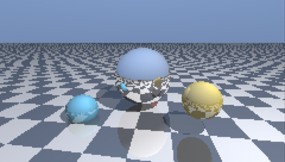

# PSP Raytracer

A real-time ray tracer for the Sony PSP, written in Rust.



Four spheres orbit over an infinite checkerboard. Every pixel follows a ray:
one primary ray for the surface, one shadow ray towards the light, and one
reflection bounce where the surface is mirrored. That is why the spheres appear
in each other and upside down in the floor.

None of this uses the PSP's GPU, because it cannot do any of it — it is a
fixed-function unit from 2004 that textures triangles. Every ray is followed in
software on the 333 MHz MIPS Allegrex CPU.

The scene is traced at 240x136 — half the screen in each direction — and each
traced pixel is written as a 2x2 block, filling 480x272 exactly. One ray covers
four pixels.

## Measured

600 frames under PPSSPP, timed by the PSP's own real-time clock:

| | |
|---|---|
| Frame rate | 4.24 fps |
| Per frame | 235.8 ms |
| Traced resolution | 240x136, scaled 2x |

Cost is linear in the number of rays, with nothing else worth measuring: at
120x68 the same scene runs at 16.82 fps, and four times the rays gives 4.24,
against 4.20 predicted.

That number is emulated time, not a hardware measurement. PPSSPP is not
cycle-accurate, so treat it as a regression signal rather than a prediction of
what a real PSP would do.

## Building

Needs the [psp-rust](https://github.com/chriopter/psp-rust) SDK as a sibling
checkout, a Rust nightly, and `cargo-psp`:

```sh
git clone https://github.com/chriopter/psp-rust ../psp-rust
cargo install --path ../psp-rust/cargo-psp
rustup toolchain install nightly
rustup component add rust-src --toolchain nightly

RUSTUP_TOOLCHAIN=nightly cargo psp --release
```

The result is `target/mipsel-sony-psp/release/EBOOT.PBP`, which runs on a PSP
with custom firmware or in an emulator.

## Running it without a screen

```sh
./run-in-ppsspp.sh
```

Starts PPSSPP under Xvfb, with no window and no audio device. Set `PPSSPP_BIN`
if PPSSPP is not on `PATH`. The demo renders 600 frames, writes
`ms0:/raytracer-result.json` and exits, so a script can tell whether the run
finished instead of a person having to watch it.

## Continuous validation

```sh
/path/to/psp-devloop/devloop psp-devloop.config
```

[psp-devloop](https://github.com/chriopter/psp-devloop) builds the demo, runs it
in the emulator, waits for the result file and checks that all 600 frames were
rendered. Which makes this demo a test as much as a toy: it exercises the
floating-point paths and the display setup of the SDK against whatever nightly
is installed, and `mipsel-sony-psp` is a Tier 3 target that nothing in the Rust
project builds or tests.

The hardware stage is deliberately empty — there is no PSP here, and a passing
emulator stage is never evidence about hardware.

## Notes

The crate is edition 2024 while the SDK it depends on is still edition 2018.
Editions are per crate, so that works, and it is worth stating because
modernising the SDK is an open question upstream.

Float math comes from `libm` rather than `psp::math`. The SDK's version is
written in VFPU assembly and is the subject of upstream issue #113, where
`cosf32` crashes on real hardware while working fine in an emulator.

## Licence

MIT.
